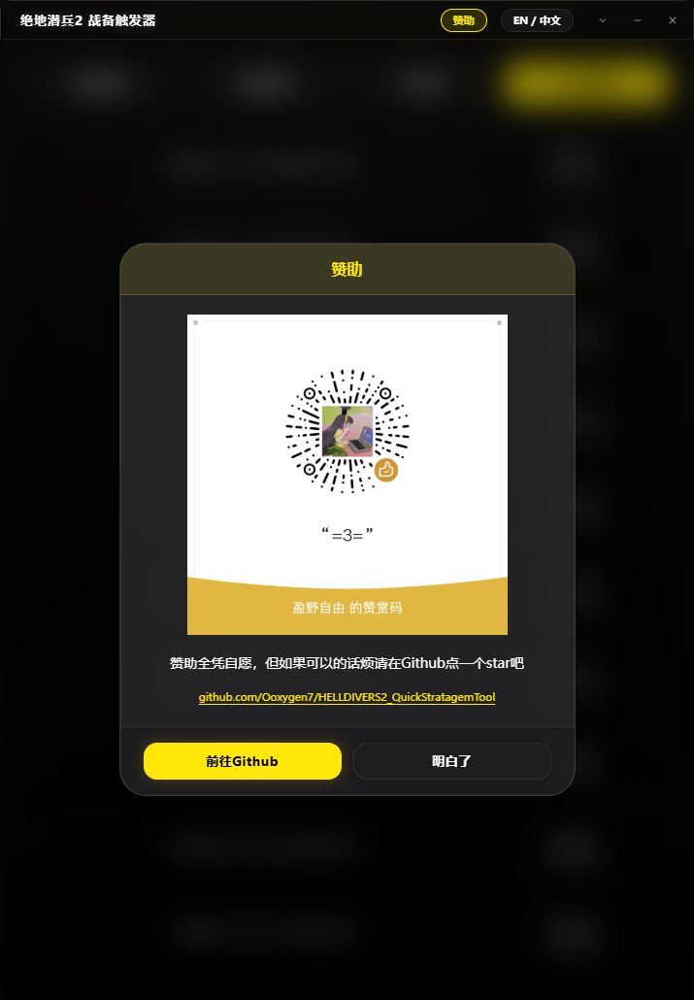
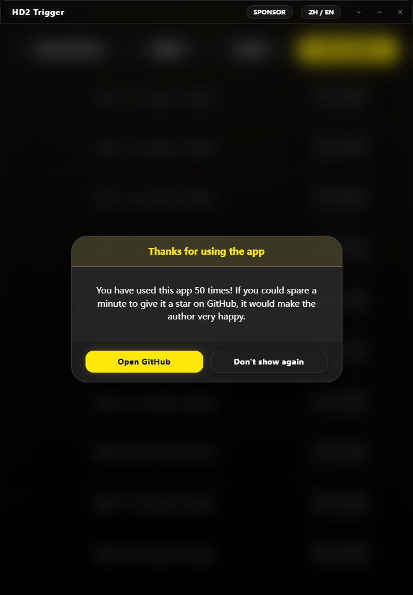

# 赞助与使用提醒

赞助窗口显示随软件打包的赞赏码原图，提供 GitHub 仓库链接，并支持中文和英文。图片仅等比例缩放，无需加载外部支付页面。

软件在第 10、20、50 次启动时各提醒一次。选择“前往 Github”会打开仓库；选择“不再显示”会永久关闭后续提醒。按 Esc 仅关闭当次提醒。

- 次数只保存在本机，不发送到服务器。
- 已安装旧版本的用户从升级后首次启动开始计数，不推测历史次数。
- 刷新界面或重复打开已运行的软件不会增加次数。
- 提醒等待版本更新、战备库更新和其他已打开的弹窗处理完后显示，不覆盖这些弹窗。
- 关闭提醒的选择独立保存，不受预设、战备库或游戏设置保存影响。
- 诊断中心、报告导出和对应的运行记录功能已移除，现有操作错误提示保留。

以上截图来自 Windows 下的真实 Tauri/WebView2 测试窗口，使用隔离的空白测试数据。
